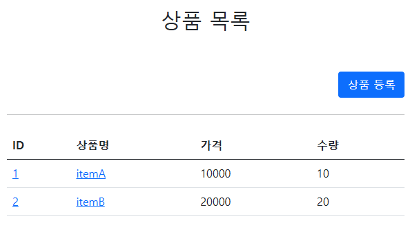
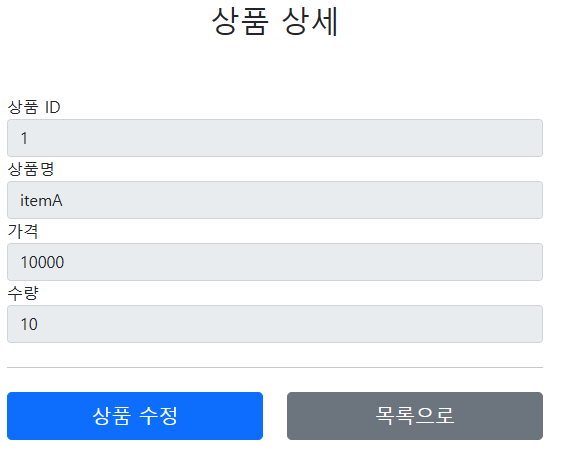
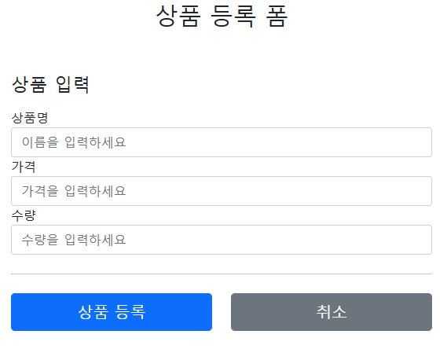
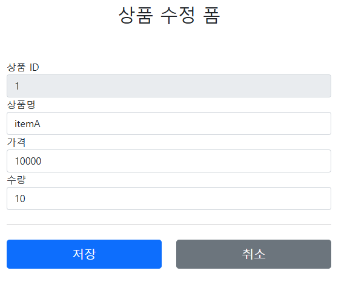

# 상품 관리 프로젝트

### 요구사항 분석
**상품 도메인 모델**
* 상품 ID
* 상품 이름
* 상품 가격
* 상품 수량

**상품 관리 기능**
* 상품 목록
* 상품 상세
* 상품 등록
* 상품 삭제

---

## 서비스 화면
### 상품 목록 페이지  
  

* 상품 등록 클릭 시 **상품 등록 페이지**로 넘어감
* 상품 Id나 상품명을 클릭 시 **상품 상세 페이지**로 넘어감

### 상품 상세 페이지 
  

* 상품 수정 클릭 시 **상품 수정 페이지**로 넘어감
* 목록 클릭 시 **상품 목록 페이지**로 넘어감

### 상품 등록 페이지

* 상품 등록 클릭 시 등록한 **상품의 상세 페이지**로 넘어감 + **저장 완료 문구**가 뜨게 설정
* 취소 클릭 시 **상품 목록 페이지**로 넘어감

### 상품 수정 페이지

* 저장 클릭 시 **상품 상세 페이지**로 리다이렉트
* 취소 시 **상품 상세 페이지**로 이동
---

### 서비스 제공 흐름
1. 상품 목록에서 클라이언트가 상품 등록 시 상품 등록 폼 호출
2. 상품 등록 폼에서 상품을 저장하면 상품 상세 폼을 내부적으로 호출
3. 상품 상세 폼에서 상품 수정 시 상품 수정 폼 호출
4. 상품 수정 저장 후 상품 상세 폼 리다이렉트
